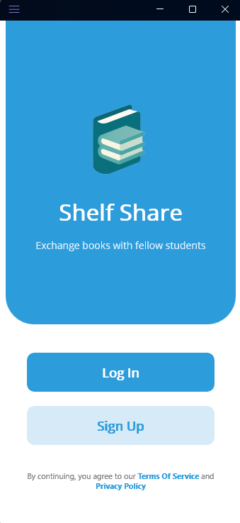
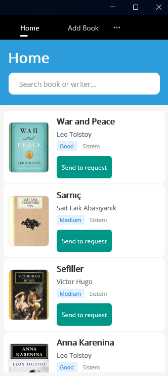
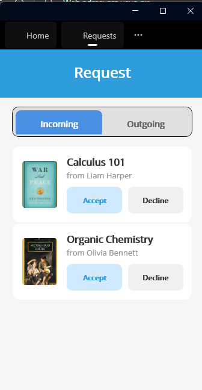
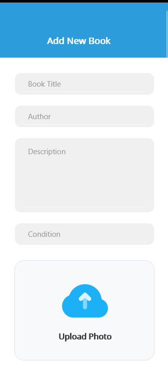
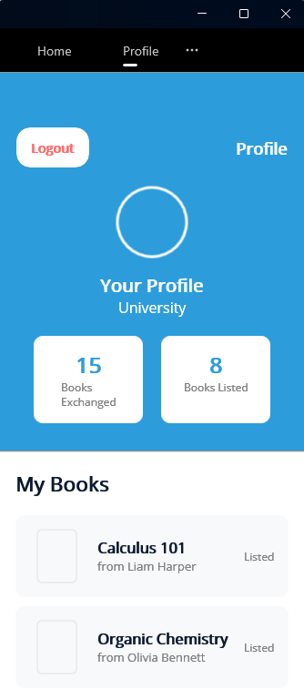

# 📚 SelfShare - Student Book Exchange Platform

**SelfShare** is a cross-platform mobile application designed to facilitate peer-to-peer book sharing among university students. Built with **.NET MAUI**, it demonstrates a modern, scalable approach to cross-platform mobile development using a single C# codebase for both Android and iOS.

---

## 📱 App Screenshots

| Login | Home Feed | Request System | Add New Book | User Profile |
|:---:|:---:|:---:|:---:|:---:|
|  |  |  |  |  |
| *Secure Login* | *Browse Books* | *Manage Requests* | *List Resources* | *Track Stats* |

---

## 🚀 Tech Stack & Architecture

* **Framework:** .NET MAUI (.NET 8/9)
* **Language:** C#
* **Architecture:** MVVM (Model-View-ViewModel) Pattern
* **Data Persistence:** Entity Framework Core (SQLite)
* **UI:** XAML with Custom Controls & Material Design principles
* **Authentication:** Custom Identity Management (Login/Register logic)

## 💡 Key Features

* **User Authentication:** Secure login and registration system.
* **Book Management (CRUD):** Users can list, edit, and remove books from their profile.
* **Search & Filtering:** Dynamic search functionality to find specific titles or authors.
* **Request System:** A complete state-management system for book exchanges (Pending -> Accepted/Declined).
* **Profile Management:** User-specific dashboard to track exchanges and currently listed books.

## 🔧 Installation & Setup

1.  **Clone the repository**
    ```bash
    git clone [https://github.com/KULLANICI_ADIN/SelfShare.git](https://github.com/KULLANICI_ADIN/SelfShare.git)
    ```
2.  **Open in Visual Studio**
    * Ensure the `.NET MAUI` workload is installed.
3.  **Build & Run**
    * Select an Android Emulator or connect a physical device.
    * Press `F5` to build and deploy.

---

## 👨‍💻 Author

**Fırat Karataşoğlu**
*Software Engineering Student & Google AI Academy Fellow*

* www.linkedin.com/in/firat-karatasoglu
